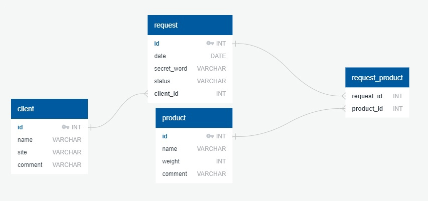

# ТЕСТОВОЕ ЗАДАНИЕ
В базе данных есть три типа: **Клиенты**, **заявки**, **продукция**.

**Поля клиента:** Имя, сайт, комментарий.

**Поля заявки:** дата создания, кодовое слово, статус заявки (в работе, отгружено, выполнено)

**Поля продукции:** наименование, вес, комментарий.

У каждого клиента может быть несколько заявок. В заявках может находиться несколько видов продукции.
Составить корректную схему в бд + CRUD (REST API)

**СУБД:** postgres/mysql

## База данных


### Database: PostgreSQL

Для реализации задания была создана структура базы данных, указанная на изображении выше. 
В проекте были использованы возможности генерации базы данных, на основе аннотаций. 

Базу так же можно сгенерировать при помощи подготовленных **sql команд**, находящихся в папке **config**.

**На основе требований тестового задания были созданы следующие связи:**

У каждого клиента может быть несколько заявок (**@OneToMany**):
- Client -> Request

В заявках может находиться несколько видов продукции (**@ManyToMany**):
- Request <-> Product


## API

Для описания и документирования был использован **Swagger**. Подробнее о том, как можно обратиться к Swagger UI для изучения API проекта, можно узнать в блоке **Запуск и тестирование приложения**.

Проектирование **веб-API RESTFUL** может происходить по-разному. 

Поэтому, было принято решение использовать за основу рекомендации из документации Microsoft: [Проектирование веб-API RESTFUL](https://docs.microsoft.com/ru-ru/azure/architecture/best-practices/api-design).

В документации подробно описываются проблемы, которые следует учитывать при разработке веб-API, а так-же варианты их решения.

Api проекта разделено на 2 части:
- административная Api подойдет для серверного типа приложений;
- клиентская Api подойдет для работы с web проектом.

Административный тип использует разделение контроллеров на отдельные категории, в зависимости от моделей, в то время как Клиентский тип Api предоставляет возможности многоуровневого контроллера для взаимодействия со всей базой.

**ClientController** реализует возможности многоуровневого доступа для пользователя.

В то время как оставшиеся контроллеры реализуют возможности административного управления.

**Окончательный выбор того какой api использовать, остаётся на усмотрение гайдлайна компании.**


## Запуск и тестирование приложения


1. Запустить проект

```
$ mvn spring-boot:run
```

2. Перейти http://localhost:8090/swagger-ui.html для ознакомления с API проекта

```yml
server:
  port: 8090
```
Для тестирования работы приложения, можно воспользоваться возможностями **Swagger UI** или воспользоваться **curl запросами**.

### Примеры запросов
**1. Создание нового пользователя:**
```thymeleafurlexpressions
curl --location --request POST 'http://localhost:8090/clients/' \
--header 'Content-Type: application/json' \
--data-raw '{
    "name": "Test User",
    "site": "www.google.com",
    "comment": "Test comments"
}'
```
**2. Получение всех клиентов:**
```thymeleafurlexpressions
curl --location --request GET 'http://localhost:8090/clients/' 
```
**3. Обновление информации о клиенте:**
```thymeleafurlexpressions
curl --location --request PATCH 'http://localhost:8090/clients/1' \
--header 'Content-Type: application/json' \
--data-raw '{
    "name":"Update Name",
    "comment":"Update comment"
}' 
```
**4. Получение заявки текущего клиента по ID заявки:**
```thymeleafurlexpressions
curl --location --request GET 'http://localhost:8090/clients/1/requests/5'
```
**5. Создание новой заявки:**
```thymeleafurlexpressions
curl --location --request POST 'http://localhost:8090/requests/' \
--header 'Content-Type: application/json' \
--data-raw '{
"secretWord":"testword",
"status":"COMPLETED",
"client_id":1,
"products_id":[2,3,5]
}'
```
**6. Обновление информации заявки:**
```thymeleafurlexpressions
curl --location --request PATCH 'http://localhost:8090/requests/6' \
--header 'Content-Type: application/json' \
--data-raw '{
"secretWord":"testwordUpdate",
"status":"UPLOADED",
"client_id":2,
"products_id":[2,4,8]
}'
```
**7. Создание нового продукта:**
```thymeleafurlexpressions
curl --location --request POST 'http://localhost:8090/products/' \
--header 'Content-Type: application/json' \
--data-raw '{
    "name":"testProduct",
    "weight":143.4,
    "comment":"test comment"
}'
```
и тд.


## Предложения по улучшению приложения

Поскольку в задании не прописаны некоторые вещи, я считаю, что можно улучшить текущее приложение следующими доработками:
1. Добавить **пагинацию** *(разделение списка нескольких записей на подсписки)* на **endpoint'ы**, которые предоставляют доступ к массивам и **лимитировать кол-во возвращаемых значений** *(если кол-во получаемых данных будет превышать допустимый порог)*;
2. Добавить фильтрацию для клиентов, заявок и продуктов;
3. Добавить авторизацию и роли (администратор, пользователь и тд.) для разграничения доступа к api.

Я не стал добавлять данные предложения в проект, поскольку это бы увеличило кол-во времени на разработку. 